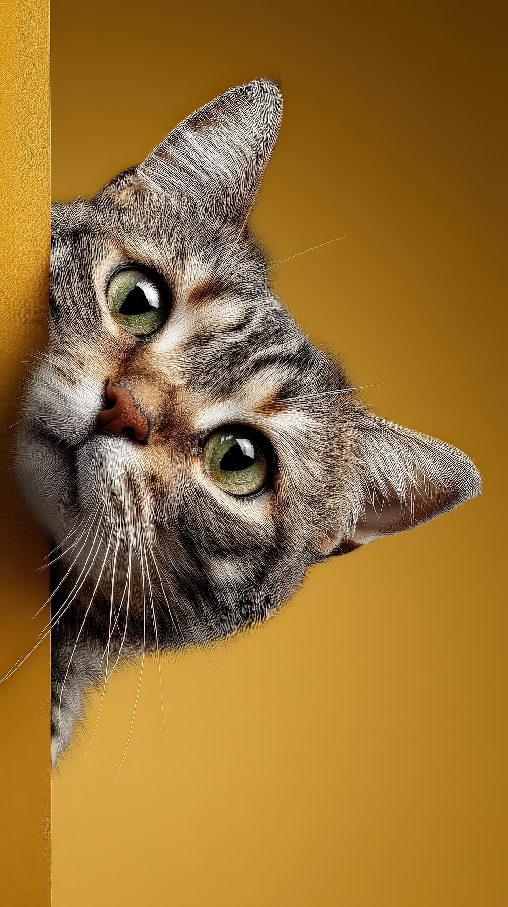

<!--
========================================================================
🔊 Rock the docs 🤘😎  —  Marco Spinello

A 30-minute conference talk for fellow tech writers.
Thesis: writers are bandmates, not session musicians.
Spine: Foundation → Voice → Polish → Tooling.
Section budget (Option C, unequal weights):
  Open ~2m · About+Map ~2m · Foundation ~5–6m · Voice ~6m
  Polish ~9m · Tooling ~5–6m · Close ~2m

Original talk-announcement copy preserved at the bottom of this file as a
speaker reference. Do NOT delete; it has phrasing we plundered for the
cold open and may seed Q&A.
========================================================================
-->

<!-- _class: lead -->

# 🔊 Rock the docs 🤘😎

### Bandmates are just loud tech writers

*Marco Spinello*

Senior technical writer at Booking.com

<!--
Welcome the room. The 🤘😎 is on purpose — sets the tone now, not later.
~30 seconds on the title slide. Don't introduce yourself yet — slide 6.
-->

---

<!-- _class: lead -->

## I used to play in an 8-piece disco band

## 💃 🪩 🕺

<!--
Lead with the personal hook. A beat of audience confusion is exactly right.
Don't explain yet. Let it land.
-->

---

<!-- _class: lead -->

## Then it became a power trio

- Guitar 🎸 🎶
- Bass 🎸 ⬇️
- Drums 🥁

<!--
The audience starts doing the math: 8 → 3.
Mime the shrinking with your hands if you want.
-->

---

<!-- _class: lead -->

## Same shape as your last reorg: 🫠

<!--
Bridge. Recognition laugh expected.
The band experience and the corporate experience share the same shape:
shrinking, pivoting, deciding who's load-bearing.
-->

---

<!-- _class: lead -->

Writers are bandmates, not session musicians.

🤲 + 🙌 = 💪 ✨

<!--
This is the talk. Read it slowly. Stop. Let it sit.

Photographable slide #1 — people will start typing.
-->

---

## About me

- ✍️ Senior technical writer at Booking.com
- 🎸 Guitar player in an instrumental power trio
- 🎚️ Co-mixed and co-mastered our album
- 🤷 No CS background
- 🐾 Curious as a cat

<!--
~30 seconds. The detail that matters is the third bullet:
"Co-mixed and co-mastered the record." That's not just a fan with a metaphor —
that's having been in the rooms where the work happens.
-->

---

## Where we're going

1. **Foundation** - 🥁 the rhythm section
2. **Voice** -  🎸 🥁 🎶 what the band sounds like
3. **Polish** - 🎚️ 🎛️ the producer's chair
4. **Tooling** - 🧰 🔄 the workflow as instrument

Four roles. One thesis. Thirty(ish) minutes.

<!--
Quick orientation. Don't dwell.
"Each of these maps to a part of your job. We're going to walk through them as a band."
-->

---

## 1. Foundation

### The rhythm section

Style guides, IA, linters. The stuff nobody applauds.

<!--
Set up the section. The rhythm section is what the band stands on.
Same for docs: style guides, information architecture, the linter.
Boring on paper. Load-bearing in practice.
-->

---

## Empire State Building

Three players. One pulse. One building.

<!--
If the venue allows audio, play 30 seconds of "Empire State Building". Otherwise just describe it.

The point: the rhythm section isn't multiple people doing similar jobs.
It's a single system, locked together. That's information architecture.
That's a style guide everyone follows. That's the linter that catches the
same drift every time.
-->

---

  <iframe
    style="border: 0; width: 400px; height: 406px;"
    src="https://bandcamp.com/EmbeddedPlayer/album=1522315087/size=large/bgcol=333333/linkcol=fe7eaf/artwork=small/transparent=true/"
    seamless
  >
    <a href="https://spinello-band.bandcamp.com/album/be-style">Be-Style by Spinello</a>
  </iframe>

  Empire State Building: reggae vibe, but tight.

---

## What "session musician" mindset misinterprets

> *Style guides are boring.* \
> *IA is infrastructure.* \
> *Linters are nags.*

### All three are the foundation everyone plays on

<!--
Push back gently. The session-musician mindset treats foundation as
someone else's job — the IA team, the linter, the platform.

But the band that ignores its foundation falls apart in the first chorus.
If your foundation is broken, no one hears the song.
-->

---

## If you have no style guide

Your style guide is whoever shouts loudest in the PR.

## 🗣️ 🔊

**Lock the foundation, then play**

<!--
Concrete: pick one foundation thing your team has been deferring
(style guide, IA review, linter setup) and put it on this week's calendar.
One thing.

Manifesto preview — "Lock the foundation, then play." It lands again at the close.
-->

---

## 2. Voice

### In a power trio, there's no singer

The guitar 🎸 is the voice. 🎙️

<!--
Bridge. We've covered the rhythm section; now: who is the voice?

In a trio, there's no separate vocalist. The guitar carries the melody,
the personality, the screams. Voice is *played*, not just spoken.

Same in docs: voice isn't owned by one person with "writer" in their title.
-->

---

<!-- _class: lead -->

Voice isn't the singer's job

## It's a band sport 🤝 🙌

<!--
Stop. Let it land.

This is the controversial line of the talk. The room may include writers who
think of voice as their own deliverable — the "tone of voice" doc, the brand
bible, the thing the writer owns.

We're going to challenge that.
-->

---

## First Born

Three voices, no frontperson

- Bass: groove and melody
- Guitar: harmony and melody
- Drums: rhythm and melodic accents

Main riff: bass groove + guitar harmony + drum accents = voice.

<!--
Voice isn't who holds the microphone. It's what the band agrees on.
Main riff: bass groove + guitar harmony + drum accents = voice
-->

---

  <iframe
    style="border: 0; width: 400px; height: 406px;"
    src="https://bandcamp.com/EmbeddedPlayer/album=1522315087/size=large/bgcol=333333/linkcol=fe7eaf/artwork=small/transparent=true/"
    seamless
  >
    <a href="https://spinello-band.bandcamp.com/album/be-style">Be-Style by Spinello</a>
  </iframe>

  First Born: three layers, one voice, one groove.

---

## What "session musician" mindset misinterprets

> *Writers as voice-cops policing PRs* \
> *Nobody reads the "tone of voice" doc* \
> *Voice as a deliverable instead of a property*

<!--
The session-musician model: writer hands voice down from on high; everyone else
complies (or doesn't).
The band model: voice is what the band does on a Tuesday afternoon when nobody's
watching.

If only the writer cares about voice, you don't have a voice — you have a brand bible.
-->

---

## Don't be the voice cop

### Run the voice as a band activity

**Find the voice *with* the band, not *for* the band.**

<!--
Concrete: invite engineers/PMs/designers to a 30-minute "voice listening" session.
Read three docs together. What do they sound like? Whose voice is that?
Voice gets fixed when the band hears itself.
-->

---

## 3. Polish

### The producer's chair

### 🎛️ 🎚️ 🎧

Mix, master, and shape the record.

<!--
This is the section that matters most to me personally. Polish — the
producer/engineer chair. This is where I spent the most time in the band.
This is where I learned the thesis is true.

Slow down here. The next ~9 minutes are memoir.
-->

---

## Get the sound right at the amp

If the source is solid, mixing becomes aesthetic.

Chiseling 🗿, not repair 🩹.

### That's shift-left for bands

<!--
The whole band did this work before we hit record. Solid amp tones, tight rhythm,
instruments tuned to each other's frequencies. When the source is good, the mix
is *artistic* — we used EQ, shimmer reverb, modulation as chisels, not as damage
control.

Name the term: that's *shift-left*. The audience knows it from their own org's
playbook. The docs version: get IA, style, and voice right at the source — then
review and editing become craft, not repair.

This is also why I could afford to "stay for the mix" in the next slides — there
was art to make, not damage to undo.
-->

---

## When we recorded the album

We tracked over two weekends in a friend's studio.

The record we wanted didn't exist yet.

It lived scattered across takes, edits, and the mix.

<!--
Set the scene with your actual story. Date, place, mood — fill in the specifics
the audience can picture. Keep it short and concrete; people lean in for stories.
-->

---

## Don't ship the files and walk away

I sat next to the engineer for the mix.

He's also a friend.

Many opinions. One pair of speakers. Lots of back and forth.

<!--
The friendship matters: we trusted each other to push back. The work matters:
every fader move was an argument we were having about what the band sounded like.

I wasn't there to "approve." I was there because the mix was the work.
-->

---

## Okefenokee (3'24")

The song slows down, opens up, and creates space to breathe.

- Tight bass and rhythm guitar — minimal effects
- Drums go Bonham — deep kick, deep toms, ethereal cymbals
- The break leads into the solo

<!--
Bring the audience into the song. If A/V allows, play 10–15 seconds of the break.
Otherwise paint it: the rest of the song is tight rhythm and groove — this break
is the *contrast*. Cinematic rock. Space to breathe.

The mix moves here are mostly *subtractive* — pulling effects off bass and rhythm
guitar so the drums can be huge. That's a band decision before it's a mix decision:
we agreed in the rehearsal room that this section breathes.

(Clarify "Drums go Bonham" aloud as needed: deep kick, deep toms, ethereal
ride/crash — the Bonham/Zeppelin signature feel.)
-->

---

## A wave breaking on the rocks

- Bridge humbucker for fatness
- EQ for warmth
- Reverb for thickness
- Delay for depth

(Many) takes and mix decisions deliberately guide to the solo.

<!--
The wave wasn't an idea I came up with in the studio. It was the image I'd been
carrying since I wrote the part — through arrangement, through tracking, into the mix.

**The take itself was hard.** I played the solo many times before I got it right.
It had to be one whole take with no edits — there were no good places to cut. So
I kept playing until a single take from start to finish matched what I heard in
my head.

Then in the mix room, my friend the engineer and I **deliberately refined** every
layer — EQ, reverb depth, delay timing — until the sound on tape matched the
picture I'd carried since the songwriting room.

Every layer of the band — writing, arranging, tracking, mixing — was aimed at the
same image. That's what bandmates do. Session musicians track their part and hope
the rest comes together. I refused to hope. I stayed.

(Bridge to next slide: "I didn't ship the file and walk away. I stayed for the mix.")
-->

---

  <iframe
    style="border: 0; width: 400px; height: 406px;"
    src="https://bandcamp.com/EmbeddedPlayer/album=1522315087/size=large/bgcol=333333/linkcol=fe7eaf/artwork=small/transparent=true/"
    seamless
  >
    <a href="https://spinello-band.bandcamp.com/album/be-style">Be-Style by Spinello</a>
  </iframe>

  Okefenokee, 3'24": open break leads to guitar solo.

---

<!-- _class: lead -->

Don't ship the file and walk away

## Stay for the mix

<!--
This is the spine of the talk. Read slowly.

The thesis isn't an aphorism — it's a thing I literally did. And it's the thing
the audience can choose to do, or choose not to.
-->

---

## What "session musician" mindset misinterprets

> *Writers hand off drafts and disappear* \
> *Review is a checkbox* \
> *"Doc is delivered" — and then?*

<!--
You see this all the time: writer ships draft → someone "reviews" → it lands →
the writer is on the next ticket. The doc has no parent. Nobody iterates.
Nobody listens for what's wrong.

That's session-musician work. It's transactional. The mix never happens.
-->

---

## Don't close the ticket on doc submission

Stay for the review, the metrics, and the rewrite when something breaks.

**Stay for the mix**

<!--
Concrete: pick your most-read doc from the last quarter. Re-read it.
Where would you fade something down? What needs more presence?
The mix isn't done when you ship — you can come back.

Funny note: searching for "stay improve" AI generated images on Pixabay
returned lots of saxophone players:
https://pixabay.com/images/search/stay%20improve/?content_type=ai
-->

---

## 4. Tooling

### The workflow is the instrument

The rig. What you automate becomes what you can sound like.

<!--
Last section. Bridge from polish: now we're talking about what makes polish
possible at scale — the tooling, the workflow, the platform that decides what
kinds of moves you can even attempt.
-->

---

## How we shipped the record

- Live tracking with click: fault tolerant
- Rough mixes as we went: fast iteration
- Two raw mixes: checkpoints

**Review comments, approval: git PR review**

<!--
The whole recording ran like a well-managed repo:

- **Live tracking with click**, in order: drums (foundation), bass (groove),
  guitar (melody and harmonic richness). The order is the same shape as the
  docs version: structure first, then voice.
- **Reversible at every step** — every decision could be rolled back, no data
  lost. That's git, but for audio.
- **Rough mixes as we tracked** — we caught problems while songs were still
  growing. Short iteration loops, fast feedback.
- And then: **2 raw mixes → review comments → final mix**. We sat with each
  mix, marked what was off, refined, listened again. If you're a tech writer,
  you've done this shape — it's a PR review.

The point: *workflow is the tooling*. Every practice we used has a docs analog
you already know. The next slide makes them concrete.
-->

---

## What "session musician" mindset misinterprets

> *The platform is what we got given* \
> *Tooling is the platform team's problem* \
> *Workflow is overhead, not craft*

<!--
Same beat as the other three sections. The session-musician treats tooling as
something handed down — the platform team's CMS, the CI someone else maintains,
the workflow that exists because it always has. Nobody asks what the rig is
shaping.

The bandmate treats tooling as the rig: choosable, swappable, part of the sound.
What you automate becomes what you're allowed to sound like.

TODO: add a background image, e.g. ../assets/img/tooling-disowned.jpg
-->

---

## The workflow is the tooling

What you automate influences what you sound like.

| You automate | You sound like |
|:---|:---|
| Lint-on-commit | A band that never plays out of tune |
| CI for content | A band that hears themselves before the audience does |
| Templated reviews | A band whose feedback loop is shorter than their release cycle |
| Docs-as-code | A band that ships every time they rehearse |

<!--
Make the tactic concrete with examples the audience already half-believes.

If your CI doesn't lint your docs, you don't have linted docs. If your CMS
doesn't support review-as-you-write, you don't have review.
-->

---

## Audit your writer workflow

### What would a bandmate change?

**Choose your workflow like an instrument**

<!--
Concrete: spend 60 minutes mapping the writer workflow. Where does work get
stuck? What does your CMS make easy that isn't actually valuable?
What would a different tool unlock?

A bandmate optimizes the rig because the rig shapes the music.
-->

---

<!-- _class: lead -->

## The 8-piece became a trio

### It worked out because everyone was a bandmate

Nobody was a session musician.

<!--
Callback to the cold open. Now everything in between gives this its full weight.

In a trio, there's no hiding. Every player is load-bearing. Every miss is heard.
That's the docs team I want to be on.
-->

---

<!-- _class: lead -->

## The band rules

Lock the foundation, then play.

Find the voice *with* the band, not *for* the band.

Stay for the mix.

Choose your workflow like an instrument.

**Be a bandmate, not a session musician.**

<!--
The photographable slide. Read it once, slow. Then stop talking.

If only one slide makes it onto Twitter, this is the one.
-->

---

<!-- _class: lead -->

## Thank you 🙏

Questions, arguments, band recommendations — all welcome. ✨

**Marco Spinello**

<i class="fa-brands fa-linkedin"></i> [marco-spinello](https://www.linkedin.com/in/marco-spinello/)

<i class="fa-brands fa-github"></i> [marcospinello](https://github.com/marcospinello)

<i class="fa-brands fa-bandcamp"></i> [Be-Style EP](https://spinello-band.bandcamp.com/album/be-style) 🔊 🎶

<!--
Q&A. Stay loose. The talk is the talk; the conversation after is where you find
out what landed.

TODO before talk: replace [your handle] placeholders with real handles.
-->

---

<!--
========================================================================
SPEAKER REFERENCE — original talk announcement (kept for source material)

This is the meetup.com / conference-pitch copy that seeded the deck.
Useful for Q&A prep and as a phrase bank.

#### Talk title
Rock the docs

#### Short summary
What do a power trio and a docs team have in common? "Rock the Docs" draws
parallels between playing music in a band (songwriting, tone, dynamics, and
recording) and the craft of technical writing, from stakeholder management
to tone of voice and shift-left thinking.

#### Long summary
"Rock the Docs" tells the story of a disco band that shrank from eight
members to a power trio. Basically the same as a company reorg with built-in
product pivot. Music and technical writing have more in common than meets
the eye: music theory maps the territory like information architecture, a
metronome enforces discipline like git, and song dynamics prevent the "wall
of text" effect of very long, very dense docs.

Guitar tone becomes tone of voice, equalization adjusts it per content type,
and effects act as admonitions that highlight key sections.

The band recording is their MVP, scoped and time-boxed, just like any good
documentation deliverable.

#### Talk announcement on meetup.com
The discotheque gets disco-technical, as Marco Spinello, technical writer at
Booking.com shows us how music theory can be applied to documentation, using
examples from both his professional and creative life.

This light-hearted look at technical writing will cover:
- Why Git is like a metronome
- Why managing stakeholders is not unlike managing band members
- Why recording an album is not unlike delivering an MVP
========================================================================
-->
